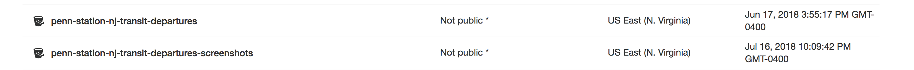

# PennStationNJTransit

[](https://greenkeeper.io/)

The goal of this project is to serve two purposes.
1. Consistently scan the [NJTransit departure board](http://dv.njtransit.com/mobile/tid-mobile.aspx?SID=NY) for Penn Station every 1 minute and store the information presented there in a database.
2. Collect enough historical results on track numbers, times at which those track numbers appear, and delays, in order to create a predictive model that provides likelihoods that any given train (specified by departure time and line, like Montclair Boonton or Morristown) will depart from a specific track or be delayed.

The first part is currently being done with an AWS Lambda function that runs every minute based on a CloudWatch cron expression. This was accomplished by using a [starter kit](https://github.com/sambaiz/puppeteer-lambda-starter-kit) which runs Headless-Chrome, which I am using to make the HTTP requests to the departure board URL as well as taking a screenshot of it.



## Approach

In order to accomplish this, there must be an automatic way to retrieve the current departure board and store the results. Historical departures must easily be queried by specifying Departure Time and Line (combination of two fields to create the primary key) along with a date range, start `YYYY-MM-DD` and end `YYYY-MM-DD` where end must be the same or after start. Results should look something like:

```
{
  line: 'Morristown Line',
  departure_time: '1:00pm',
  departures: [
    {
      date: '2017-10-17',
      track: 7,
      track_appeared_at: '12:51pm'
    },
    {
      date: '2017-10-18',
      track: 4,
      track_appeared_at: '12:50pm'
    },
    {
      date: '2017-10-19',
      track: 4,
      track_appeared_at: '12:52pm'
    },
    {
      date: '2017-10-20',
      track: 6,
      track_appeared_at: '12:50pm'
    },
  ]
}
```

This information can then be analyzed in conjunction with the corresponding results for departures of trains scheduled to leave 5-20 minutes before the one you're trying to predict. For example, if the High Bridge line train departing at 12:49pm leaves from track 3, there might be a 0% chance the 1pm Morristown Line departure to Dover leaves from track 3 as well. More useful predictions could be derived by chaining together a series of departures happening before the one in question.
